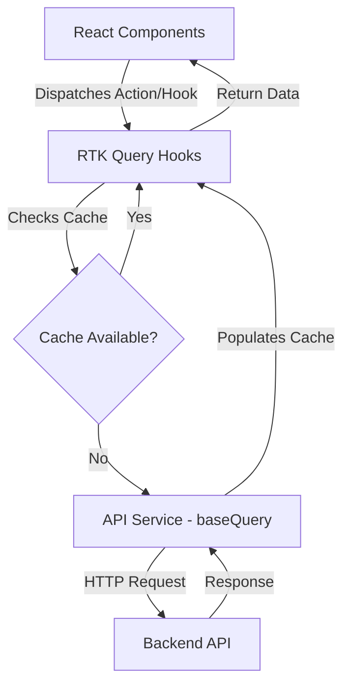

# Project Architecture - Threads Clone

This document describes the high-level architecture and design decisions behind the **Threads Clone** project. Its purpose is to help developers understand how the system is organized and how data flows through the application.

## 1. Overview
The **Threads Clone** is a social media platform built as a **Single Page Application (SPA)** using React. It aims to replicate the core user experience of Threads, focusing on threaded conversations, media sharing, and a premium, high-performance UI.

## 2. Tech Stack
The project leverages modern web technologies to ensure a smooth development experience and high performance:

- **Core:** React 19 + Vite (Next-generation frontend tooling).
- **State Management:** Redux Toolkit (RTK) & RTK Query (Advanced server state management and caching).
- **Styling:** Tailwind CSS (Utility-first styling for consistent design system).
- **Animations:** Framer Motion (Fluid micro-interactions).
- **Icons:** Lucide React.
- **Form Handling:** React Hook Form & Zod (Schema-based validation).
- **Internationalization:** i18next (Support for English and Vietnamese).

## 3. Folder Structure
The project follows a hybrid **Feature-based** and **Layer-based** architecture for better modularity:

```text
src/
├── components/         # UI Elements
│   ├── Common/         # Reusable atomic components (Button, Input, Spinner, Modals)
│   ├── post/           # Specific components related to Posts (PostCard, CreatePostModal)
│   └── Features/       # Specific logic-heavy components (Comments, Notifications)
├── pages/              # Main route entries (Home, PostDetail, Profile, Deck)
├── services/           # Data Fetching Layer (RTK Query API definitions, baseQuery)
├── store.js            # Redux Store configuration
├── hooks/              # Custom React hooks (useAuth, useScrollToTop)
├── configs/            # App settings (API URLs, Route Paths)
├── schemas/            # Zod validation schemas
├── i18n/               # Localization configuration
└── utils/              # Helper functions (HTTP request wrappers, formatting)
```

## 4. State Management
We distinguish between **Server State** and **Client (UI) State**:

### Global Server State (RTK Query)
- Managed via `authApi` and `postApi`.
- **Caching:** RTK Query caches data automatically. We use `providesTags` and `invalidatesTags` to ensure UI consistency (e.g., refetching the feed after creating a post).
- **Infinite Scroll:** Implemented using a custom `merge` logic in RTK Query to append new pages to the existing cache without reloading the entire list.

### Local UI State
- Managed via React's native `useState` and `useReducer` for ephemeral states like modal visibility, form inputs, or temporary UI toggles.

## 5. Data Flow
The application follows a unidirectional data flow:



## 6. API Design & Integration
- **Base Query:** A customized wrapper around Axios (`httpRequest.js`) that handles authentication headers and error normalization.
- **Pagination:** Uses `page` and `per_page` parameters. The frontend maintains the `page` number and uses RTK Query's `serializeQueryArgs` to scope cache entries by entity ID (e.g., `postId`).
- **Mutation:** Actions like Liking, Reposting, or Deleting trigger optimistic updates or tag invalidation for instant UI feedback.

## 7. Error Handling
- **API Level:** `baseQuery` catches Axios errors and transforms them into a consistent structure `{ status, data }`.
- **Auth Level:** A dedicated interceptor handles `401 Unauthorized` errors to redirect users to login or trigger token refresh logic.
- **UI Level:** `react-toastify` and `sonner` provide real-time feedback to the user for failed mutations or network issues.

## 8. Scalability & Performance
- **Code Splitting:** Route-based lazy loading to reduce initial bundle size.
- **Memoization:** Strategic use of `React.memo` for expensive components like `PostCard` to prevent unnecessary re-renders in long lists.
- **Optimized Assets:** Theme-dependent SVG loading and efficient image handling for high-density displays.

## 9. Non-goals
- **SEO Optimization:** While the app indexation is considered, full SSR (Server Side Rendering) is not a priority for this internal/educational version.
- **Complex Real-time:** Current implementation uses polling or refetching on navigation rather than persistent WebSockets/SSE for feed updates.

## 10. Future Plan
- **Testing:** Integration of Unit Tests with Vitest and E2E tests with Playwright.
- **Performance:** Moving towards Next.js for better Server Components support.
- **Offline Support:** PWA capabilities for a more native app-like experience.
